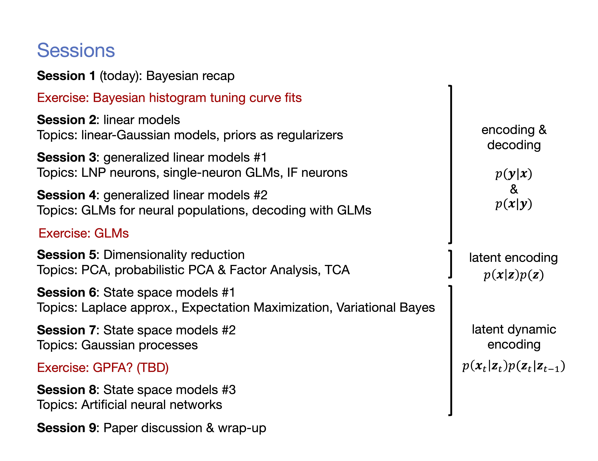

# Harvard Medical School – NeuroBio 316QC course notes

This repository contains my notes for the course **NeuroBio 316QC: Probabilistic models for neural data: from single neurons to population dynamics** at Harvard Medical School:

> Probabilistic models are a powerful approach for gaining an understanding of what drives the activity of individual neurons and neural populations.
? This course will dissect their modular, plug-and-play structure, from single-neuron models over generalized linear models to state space models for population dynamics.
> Students will learn their basic building blocks, and how to flexibly assemble them to suit their own data analysis needs.
>
> Upon completion of the course, students should be able to (i) identify the model structure and associated assumptions of common models in the literature; (ii) apply existing probabilistic models to neural datasets; and (iii) flexibly design new models by re-using existing model components.

The topics for the sessions of the course are outlined below:



---

## Code snippets

Create the conda environment for this repo.
I used mamba because it is generally faster than conda.

```bash
conda create -n neuro316 -c conda-forge python=3.9 mamba
mamba env update --name neuro316 --file environment.yaml
```

Convert a Markdown "write-up" into a PDF for submission.

```bash
cd exercises/
pandoc --defaults writeup-defaults.yaml -o 02_exercise-1-writeup.pdf 02_exercise-1-writeup.md
```
